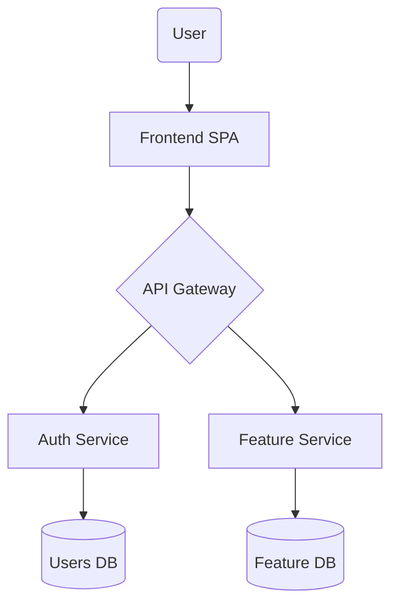
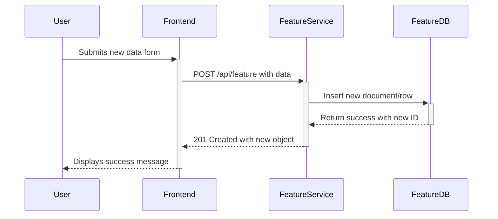

# [Feature Name] Technical Design

Project/FeatureName

## **1. Overview**

### **1.1. Problem Statement**

*Describe the core problem this system is designed to solve. Example: "Users lack a centralized platform to manage project tasks, leading to inefficiencies."*

### **1.2. Goals and Objectives**

*List the key technical and business goals as measurable outcomes.*

* **Business Goal:** e.g., Increase user productivity by 20%.
* **Technical Goal:** e.g., Achieve an average API response time of under 200ms.

### **1.3. Scope**

*Define the boundaries of the system to prevent scope creep.*

* **In-Scope:** e.g., User authentication, task creation.
* **Out-of-Scope:** e.g., Budgeting features, calendar integrations.

## **2. System Architecture**

### **2.1. Architecture Diagram (Mermaid.js)**

*A high-level diagram showing all components (frontend, backend services, databases, etc.) and their interactions. **Must use Mermaid.js syntax.**.*

### **2.2. Key Components & Responsibilities**

*A description of each component's purpose. This gives the AI context for writing the component's internal logic.*

* **Frontend SPA:** The client-side application responsible for all user interactions.
* **API Gateway:** Single entry point for client requests, handling routing and rate limiting.
* **Auth Service:** Manages user registration, login, and authentication.
* **Feature Service:** Handles the core business logic for the feature.

### **2.3. Frontend Component Breakdown (Optional)**

*Based on your front-end-design.md, this table details the UI structure.*

| Component Name | Type (Container/Presentational) | Responsibilities |
| :--- | :--- | :--- |
| FeaturePage | Container | Fetches data, manages page-level state. |
| FeatureCard | Presentational | Displays data, emits user events. |

## **3. Data Design**

### **3.1. Data Flow Diagram**

*Shows how data moves through the system for a key user action (e.g., creating a resource).*

### **3.2. Database Schema**

*Describes the main data structures. The AI uses this to generate ORM models and database migration scripts.*

* **Table/CollectionName**
  * `id`: Type (Primary Key)
  * `fieldName`: Type (Constraints)
  * ...

## **4. API Design (Contract)**

### **4.1. Core API Endpoints**

*List the primary endpoints required for the feature.*

*   **Endpoint:** `POST /api/v1/feature`
    *   **Purpose:** Creates a new feature resource.
    *   **Request Body:** `{ "name": "string" }`
    *   **Response Body:** `{ "id": "uuid", "name": "string" }`
*   **Endpoint:** `GET /api/v1/feature/:id`
    *   **Purpose:** Retrieves a feature resource.
    *   **Response Body:** `{ "id": "uuid", "name": "string" }`

## **5. Technical Stack & Implementation**

* **Frontend:** e.g., React (Vite), TypeScript, Tailwind CSS, React Query
* **Backend:** e.g., Node.js with Express, Go with Gin
* **Database:** e.g., PostgreSQL, MongoDB
* **Infrastructure:** e.g., Docker, Kubernetes on AWS

## **6. Technical Decisions & Trade-offs**

* **Decision:** e.g., Chose Library X over Library Y for state management.
* **Reason:** e.g., Better performance and a smaller bundle size.
* **Trade-off:** e.g., Library X has a steeper learning curve for new developers.

## **7. Non-Functional Requirements (NFRs)**

### **7.1. Scalability & Performance**

* The system must support e.g., 10,000 concurrent users with sub-e.g., 500ms response times.

### **7.2. Security**

* All API endpoints must be protected and require a valid JWT.
* All sensitive data must be encrypted at rest.

### **7.3. Observability**

* All services must produce structured logs (JSON format).
* Implement health check endpoints (e.g., /healthz) for each service.
