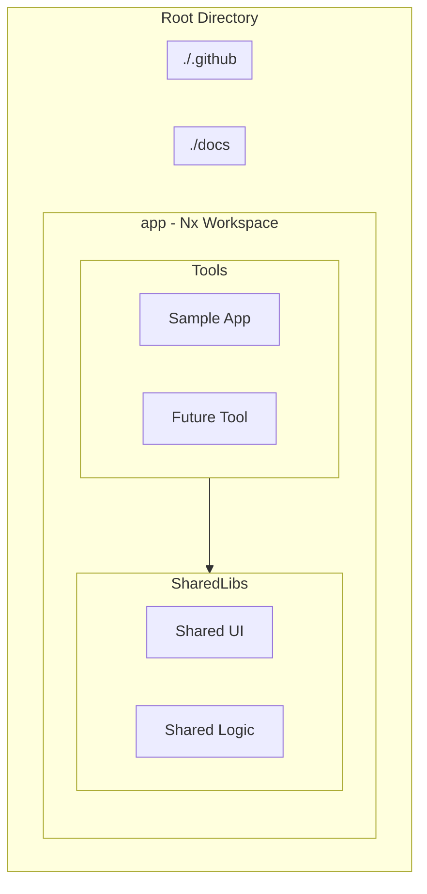
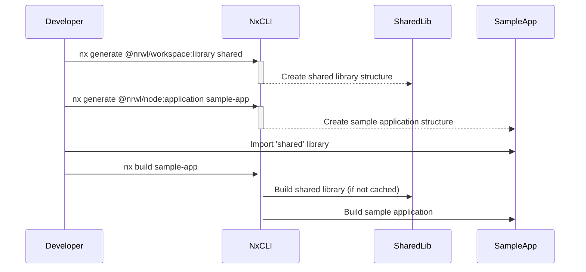

# Nx Monorepo Setup Technical Design

## 1. Overview

### 1.1. Problem Statement

Developers need a standardized and efficient way to manage multiple TypeScript-based tools within a single repository. The current approach of separate repositories leads to code duplication, inconsistent dependencies, and complex build processes.

### 1.2. Goals and Objectives

* **Business Goal:** Increase developer velocity by simplifying cross-project code sharing and centralizing development workflows.
* **Technical Goal:** Establish a scalable monorepo architecture using Nx that supports shared libraries and unified build/test commands.

### 1.3. Scope

* **In-Scope:**
  * Initializing a new Nx workspace in the `./app` directory.
  * Configuring the workspace to use `npm`.
  * Creating a sample TypeScript application to demonstrate functionality.
  * Establishing a structure for shared libraries.
* **Out-of-Scope:**
  * Migration of any existing tools into the new monorepo.
  * CI/CD pipeline implementation.
  * Detailed implementation of the sample application beyond a basic setup.

## 2. System Architecture

### 2.1. Architecture Diagram (Mermaid.js)

### 2.2. Key Components & Responsibilities

* **Nx Workspace (`./app`):** The core monorepo managed by Nx. It will contain all applications, libraries, and tooling configurations.
* **Sample App (`./app/apps/sample-app`):** A TypeScript-based application that serves as a proof-of-concept for building and running applications within the monorepo. It will consume code from a shared library.
* **Shared Library (`./app/libs/shared`):** A shared library containing reusable code (e.g., utility functions, UI components) that can be imported by any application in the workspace.

## 3. Data Design

### 3.1. Data Flow Diagram

This section is not strictly applicable as there is no dynamic data flow between persistent data stores. However, the following diagram illustrates the dependency and build flow.

### 3.2. Database Schema

Not applicable for this project.

## 4. API Design (Contract)

Not applicable for this project.

## 5. Technical Stack & Implementation

* **Core:** Nx (with `typescript` preset)
* **Package Manager:** npm
* **Language:** TypeScript
* **Sample Application:** A simple Node.js TypeScript application.

## 6. Technical Decisions & Trade-offs

* **Decision:** Use Nx for monorepo management.
  * **Reason:** Nx provides powerful features for code sharing, dependency analysis, and computation caching, which are ideal for a multi-tool monorepo.
  * **Trade-off:** There is a learning curve associated with Nx and its ecosystem.
* **Decision:** Locate the workspace in the `./app` directory.
  * **Reason:** This separates the application code from the root-level project management files (e.g., CI/CD, documentation), leading to a cleaner project structure.
  * **Trade-off:** Developers need to be aware of the two-level directory structure.

## 7. Non-Functional Requirements (NFRs)

### 7.1. Scalability & Performance

* The Nx workspace should scale to accommodate dozens of tools and libraries.
* Nx's computation caching should be leveraged to ensure fast build and test times.

### 7.2. Security

* Dependencies will be managed by `npm` and can be audited for vulnerabilities using `npm audit`.

### 7.3. Observability

* Not a primary focus for the initial setup, but the structure will allow for future integration of logging and monitoring in individual applications.
