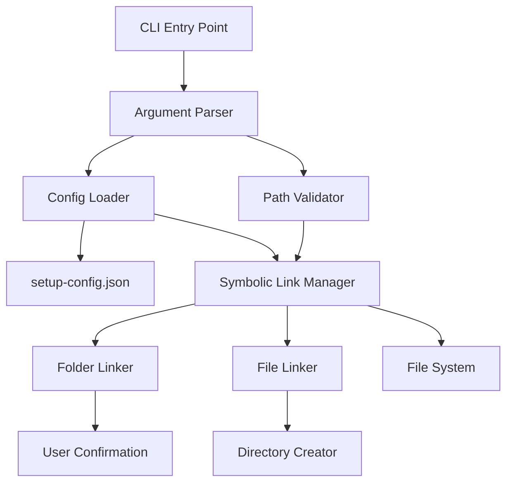
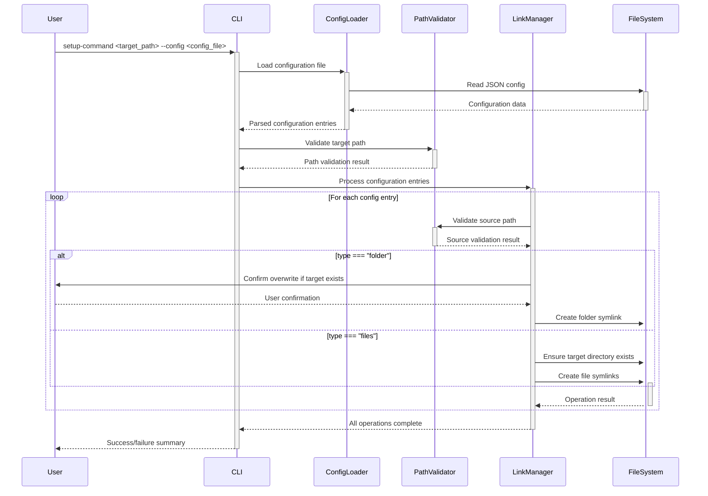

# Project Config Symlinker Technical Design

Project Config Symlinker

## **1. Overview**

### **1.1. Problem Statement**

Developers frequently need to share configuration files across multiple projects, leading to duplication and inconsistency. Manual copying and maintaining multiple versions of configuration files creates maintenance overhead and increases the risk of configuration drift between projects.

### **1.2. Goals and Objectives**

* **Business Goal:** Reduce configuration setup time by 70% and improve consistency across development projects.
* **Technical Goal:** Achieve command execution time under 5 seconds for up to 100 configuration entries.

### **1.3. Scope**

* **In-Scope:** Command-line interface, JSON configuration parsing, symbolic link creation, directory structure preservation, user confirmation prompts.
* **Out-of-Scope:** Configuration file validation, version control integration, remote project support, rollback functionality.

## **2. System Architecture**

### **2.1. Architecture Diagram (Mermaid.js)**



### **2.2. Key Components & Responsibilities**

* **CLI Entry Point:** Main executable that initializes the application and coordinates all operations.
* **Argument Parser:** Processes command-line arguments using a CLI framework (commander.js).
* **Config Loader:** Reads and parses JSON configuration files with validation.
* **Path Validator:** Validates source and target paths, ensuring they exist and are accessible.
* **Symbolic Link Manager:** Coordinates the creation of symbolic links based on configuration type.
* **Folder Linker:** Handles symbolic link creation for entire folders with user confirmation.
* **File Linker:** Creates symbolic links for individual files while preserving directory structure.
* **Directory Creator:** Ensures target directory structure exists before creating file links.
* **User Confirmation:** Handles interactive prompts for overwrite confirmations.

## **3. Data Design**

### **3.1. Data Flow Diagram**



### **3.2. Configuration Schema**

* **Configuration File (setup-config.json)**
  * `configurations`: Array of configuration entries
    * `original`: String (relative path to source folder/file)
    * `target`: String (relative path to target location, optional)
    * `type`: Enum ("folder" | "files")

Example configuration:
```json
{
  "configurations": [
    {
      "original": ".eslintrc.json",
      "target": ".eslintrc.json",
      "type": "files"
    },
    {
      "original": ".vscode",
      "target": ".vscode",
      "type": "folder"
    }
  ]
}
```

## **4. API Design (Contract)**

### **4.1. Command-Line Interface**

* **Command:** `setup-command <target_project_path>`
  * **Purpose:** Links configurations to target project using default config file.
  * **Arguments:** 
    * `target_project_path`: Required - Path to target project directory
  * **Options:**
    * `--config, -c`: Optional - Custom configuration file path (default: setup-config.json)
    * `--help, -h`: Show help information
    * `--version, -v`: Show version information

* **Exit Codes:**
  * `0`: Success - all operations completed successfully
  * `1`: Error - invalid arguments or configuration file not found
  * `2`: Error - target path invalid or inaccessible
  * `3`: Error - symbolic link creation failed

## **5. Technical Stack & Implementation**

* **Runtime:** Node.js (>=16.0.0)
* **Build System:** Vite for bundling and packaging
* **CLI Framework:** Commander.js for argument parsing and command structure
* **File System:** Node.js native `fs` and `path` modules with `fs.promises` for async operations
* **User Interaction:** Inquirer.js for interactive prompts and confirmations
* **Validation:** Custom validation utilities for path and configuration validation
* **Package Distribution:** NPM package with executable binary
* **Development Tools:** TypeScript for type safety, Vitest for testing

## **6. Technical Decisions & Trade-offs**

* **Decision:** Use Commander.js over Yargs for CLI framework.
* **Reason:** Better TypeScript support and more intuitive API for complex command structures.
* **Trade-off:** Slightly larger bundle size but better developer experience.

* **Decision:** Use Inquirer.js for user prompts instead of native readline.
* **Reason:** Rich interactive features and better cross-platform compatibility.
* **Trade-off:** Additional dependency but significantly improved user experience.

* **Decision:** Bundle with Vite instead of Webpack or Rollup.
* **Reason:** Faster build times, better ES module support, and simpler configuration.
* **Trade-off:** Newer tool with smaller ecosystem but excellent performance.

## **7. Non-Functional Requirements (NFRs)**

### **7.1. Scalability & Performance**

* The system must process up to 100 configuration entries in under 5 seconds.
* Memory usage should remain under 50MB during execution.
* Support for deeply nested directory structures (up to 10 levels deep).

### **7.2. Security**

* Validate all file paths to prevent directory traversal attacks.
* Ensure symbolic links do not point outside the target project directory.
* Sanitize user input for configuration file paths.

### **7.3. Observability**

* Provide verbose logging option for debugging (`--verbose` flag).
* Clear error messages with actionable guidance for users.
* Progress indicators for operations with multiple configuration entries.

### **7.4. Compatibility**

* Support Unix-like systems (Linux, macOS) with symbolic link capabilities.
* Node.js compatibility with versions 16.0.0 and above.
* Cross-platform path handling using Node.js path utilities.
