# Startup Building Process Using LEARN Methodology

## Mermaid DAG

```mermaid
graph TD
    %% Initial Idea
    Start([💡 Initial Idea/Problem Signal])

    %% Cross-Cutting Concerns - Always Active
    CC1{{🛡️ Red Team Review}}
    CC2{{💀 Failure Celebration}}
    CC3{{📊 Craftsmanship Debt Tracker}}
    CC4{{🚨 Crisis Decision Framework}}

    %% Phase 1: Research
    R1[💡 Hypothesis List<br/>Document assumptions]
    R2[🔍 Problem Validation Sprint<br/>3-day validation]
    R3[🗺️ Opportunity Landscape<br/>3-hour market gaps]
    R4[📄 Lean Canvas<br/>Business model]
    R5[📋 Research Experiment Summary<br/>Learning capture]
    R6[💎 Assumption Mapping Workshop<br/>Experiment prioritization]

    %% Phase 2: Design
    D1[🔧 Tech Spike Check<br/>Technical feasibility]
    D2[🧪 Experiment Brief<br/>Design hypotheses]
    D3[🗺️ User Journey Map<br/>End-to-end flow]
    D4[📝 Prototype Spec<br/>Minimum viable test]
    D5[⚙️ Tech Feasibility Check<br/>Risk assessment]
    D6[📋 Design Experiment Summary<br/>Design learning]

    %% Phase 3: Development
    Dev1[📋 Build Plan<br/>Min code to test]
    Dev2[💻 Code Implementation<br/>Debt Score 1-5]
    Dev3[✅ Pre-Flight Checklist<br/>Ready for data]
    Dev4[📋 Experiment Debrief<br/>Tech learning]

    %% Phase 4: Testing
    T1[📋 Test Plan<br/>Behavior validation]
    T2[🧪 Test Cases<br/>Specific hypotheses]
    T3[🐛 Bug Tracker<br/>Technical issues]
    T4[👥 User Feedback Log<br/>Qualitative insights]
    T5[📊 Learning Summary<br/>Data → Decisions]

    %% Phase 5: Deployment
    Dep1[🚀 Release Runbook<br/>Automated deployment]
    Dep2[📊 Monitor & Learn<br/>Production insights]
    Dep3[📋 Post-Release Log<br/>System learning]

    %% Decision Points
    Gate1{Problem<br/>Validated?}
    Gate2{Design<br/>Feasible?}
    Gate3{Hypothesis<br/>Validated?}
    Gate4{Ready to<br/>Scale?}
    Gate5{Product-Market<br/>Fit?}

    %% Success & Iteration Paths
    Pivot1[🔄 Pivot Problem]
    Pivot2[🔄 Pivot Solution]
    Pivot3[🔄 Pivot Design]
    Scale[📈 Scale & Grow]
    PMF[🎯 Product-Market Fit]

    %% Main Flow
    Start --> R1
    R1 --> R2
    R2 --> R3
    R3 --> R4
    R4 --> R5
    R5 --> R6
    R6 --> Gate1

    Gate1 -->|Yes| D1
    Gate1 -->|No| Pivot1
    Pivot1 --> R1

    D1 --> D2
    D2 --> D3
    D3 --> D4
    D4 --> D5
    D5 --> D6
    D6 --> Gate2

    Gate2 -->|Yes| Dev1
    Gate2 -->|No| Pivot2
    Pivot2 --> D1

    Dev1 --> Dev2
    Dev2 --> Dev3
    Dev3 --> Dev4
    Dev4 --> T1

    T1 --> T2
    T2 --> T3
    T3 --> T4
    T4 --> T5
    T5 --> Gate3

    Gate3 -->|Yes| Dep1
    Gate3 -->|No| Pivot3
    Pivot3 --> D2

    Dep1 --> Dep2
    Dep2 --> Dep3
    Dep3 --> Gate4

    Gate4 -->|Yes| Scale
    Gate4 -->|No| T1

    Scale --> Gate5
    Gate5 -->|Yes| PMF
    Gate5 -->|No| R1

    %% Cross-cutting connections (dashed lines)
    CC1 -.-> R1
    CC1 -.-> R2
    CC1 -.-> D1
    CC1 -.-> Dev1
    CC1 -.-> T1
    CC1 -.-> Dep1

    CC2 -.-> Gate1
    CC2 -.-> Gate2
    CC2 -.-> Gate3
    CC2 -.-> Gate4

    CC3 -.-> Dev2
    CC3 -.-> D4

    CC4 -.-> Gate1
    CC4 -.-> Gate2
    CC4 -.-> Gate3
    CC4 -.-> Gate4

    %% Styling
    classDef research fill:#e1f5fe,stroke:#01579b,stroke-width:2px
    classDef design fill:#f3e5f5,stroke:#4a148c,stroke-width:2px
    classDef dev fill:#e8f5e9,stroke:#1b5e20,stroke-width:2px
    classDef test fill:#fff3e0,stroke:#e65100,stroke-width:2px
    classDef deploy fill:#fce4ec,stroke:#880e4f,stroke-width:2px
    classDef decision fill:#fff9c4,stroke:#f57f17,stroke-width:3px
    classDef crosscut fill:#eceff1,stroke:#263238,stroke-width:2px,stroke-dasharray: 5 5

    class R1,R2,R3,R4,R5,R6 research
    class D1,D2,D3,D4,D5,D6 design
    class Dev1,Dev2,Dev3,Dev4 dev
    class T1,T2,T3,T4,T5 test
    class Dep1,Dep2,Dep3 deploy
    class Gate1,Gate2,Gate3,Gate4,Gate5 decision
    class CC1,CC2,CC3,CC4 crosscut
```



## JSON Representation

```json
{
  "methodology": "LEARN",
  "phases": [
    {
      "phase": "Research",
      "duration": "1-3 weeks",
      "goal": "Validate problem exists and is worth solving",
      "steps": [
        {
          "id": "R1",
          "name": "Hypothesis List",
          "duration": "1-2 days",
          "deliverable": "Testable assumptions ranked by risk",
          "key_metric": "All assumptions documented"
        },
        {
          "id": "R2",
          "name": "Problem Validation Sprint",
          "duration": "3-5 days",
          "deliverable": "Validated problem hypothesis",
          "key_metric": "10+ customer interviews"
        },
        {
          "id": "R3",
          "name": "Opportunity Landscape",
          "duration": "3 hours",
          "deliverable": "Market gaps and positioning",
          "key_metric": "Competitive analysis complete"
        },
        {
          "id": "R4",
          "name": "Lean Canvas",
          "duration": "1 day",
          "deliverable": "One-page business model",
          "key_metric": "Riskiest assumptions identified"
        },
        {
          "id": "R5",
          "name": "Research Experiment Summary",
          "duration": "1 day",
          "deliverable": "Learning documentation",
          "key_metric": "Next steps defined"
        },
        {
          "id": "R6",
          "name": "Assumption & Opportunity Mapping Workshop",
          "duration": "90 minutes",
          "deliverable": "Prioritized experiment queue",
          "key_metric": "Named experiments ranked by Impact/Certainty"
        }
      ],
      "gate": {
        "name": "Problem Validation Gate",
        "criteria": [
          "Problem confirmed as painful and urgent",
          "Customers willing to pay for solution",
          "Market size validated",
          "Solution approach resonates"
        ],
        "failure_action": "Pivot to new problem"
      }
    },
    {
      "phase": "Design",
      "duration": "2-3 weeks",
      "goal": "Create testable solution experiments",
      "steps": [
        {
          "id": "D1",
          "name": "Tech Spike Check",
          "duration": "1-2 days",
          "deliverable": "Technical feasibility assessment",
          "key_metric": "Core tech risks identified"
        },
        {
          "id": "D2",
          "name": "Experiment Brief",
          "duration": "1 day",
          "deliverable": "Design hypotheses",
          "key_metric": "Success/failure criteria defined"
        },
        {
          "id": "D3",
          "name": "User Journey Map",
          "duration": "2-3 days",
          "deliverable": "End-to-end user flow",
          "key_metric": "Critical moments identified"
        },
        {
          "id": "D4",
          "name": "Prototype Spec",
          "duration": "2-3 days",
          "deliverable": "Minimum viable prototype plan",
          "key_metric": "Build cost vs learning value"
        },
        {
          "id": "D5",
          "name": "Tech Feasibility Check",
          "duration": "2 days",
          "deliverable": "Architecture validation",
          "key_metric": "Technical risks mitigated"
        },
        {
          "id": "D6",
          "name": "Design Experiment Summary",
          "duration": "1 day",
          "deliverable": "Design learning capture",
          "key_metric": "User validation achieved"
        }
      ],
      "gate": {
        "name": "Design Feasibility Gate",
        "criteria": [
          "Users want this solution",
          "Technically buildable",
          "Success metrics defined",
          "Failure criteria clear"
        ],
        "failure_action": "Pivot solution design"
      }
    },
    {
      "phase": "Development",
      "duration": "2-4 weeks",
      "goal": "Build minimum code to test hypothesis",
      "steps": [
        {
          "id": "Dev1",
          "name": "Build Plan",
          "duration": "1 day",
          "deliverable": "Implementation roadmap",
          "key_metric": "Craftsmanship Debt Score set"
        },
        {
          "id": "Dev2",
          "name": "Code Implementation",
          "duration": "1-3 weeks",
          "deliverable": "Working experiment",
          "key_metric": "Core flow functional"
        },
        {
          "id": "Dev3",
          "name": "Pre-Flight Checklist",
          "duration": "1 day",
          "deliverable": "Production readiness",
          "key_metric": "Monitoring & rollback ready"
        },
        {
          "id": "Dev4",
          "name": "Experiment Debrief",
          "duration": "1 day",
          "deliverable": "Technical learning",
          "key_metric": "Architecture insights documented"
        }
      ],
      "craftsmanship_debt_scores": {
        "1": "Hardcoded MVP - for first experiments",
        "2": "Basic Logic - simple conditionals",
        "3": "Structured Code - proper patterns",
        "4": "Production-Ready - full testing",
        "5": "Enterprise-Grade - optimized & scalable"
      }
    },
    {
      "phase": "Testing",
      "duration": "1-2 weeks",
      "goal": "Validate hypothesis through user behavior",
      "steps": [
        {
          "id": "T1",
          "name": "Test Plan",
          "duration": "1 day",
          "deliverable": "Testing strategy",
          "key_metric": "Behavior metrics defined"
        },
        {
          "id": "T2",
          "name": "Test Cases",
          "duration": "2-3 days",
          "deliverable": "Specific test scenarios",
          "key_metric": "Hypothesis coverage"
        },
        {
          "id": "T3",
          "name": "Bug Tracker",
          "duration": "Ongoing",
          "deliverable": "Issue management",
          "key_metric": "Data quality maintained"
        },
        {
          "id": "T4",
          "name": "User Feedback Log",
          "duration": "Ongoing",
          "deliverable": "Qualitative insights",
          "key_metric": "Pattern identification"
        },
        {
          "id": "T5",
          "name": "Learning Summary",
          "duration": "1 day",
          "deliverable": "Decision documentation",
          "key_metric": "Next action defined"
        }
      ],
      "gate": {
        "name": "Hypothesis Validation Gate",
        "criteria": [
          "User behavior validates hypothesis",
          "Metrics show positive trend",
          "Technical performance acceptable",
          "Clear path to improvement"
        ],
        "failure_action": "Pivot design approach"
      }
    },
    {
      "phase": "Deployment",
      "duration": "1 week",
      "goal": "Scale validated experiments safely",
      "steps": [
        {
          "id": "Dep1",
          "name": "Release Runbook",
          "duration": "1 day",
          "deliverable": "Deployment automation",
          "key_metric": "Rollback time <30 min"
        },
        {
          "id": "Dep2",
          "name": "Monitor & Learn",
          "duration": "Ongoing",
          "deliverable": "Production insights",
          "key_metric": "User behavior at scale"
        },
        {
          "id": "Dep3",
          "name": "Post-Release Log",
          "duration": "1 day",
          "deliverable": "Deployment learning",
          "key_metric": "Process improvements"
        }
      ],
      "rollout_stages": [
        "Internal Testing (team)",
        "Alpha (1-5% users)",
        "Beta (10-25% users)",
        "Phased (50% then 100%)",
        "Full Production"
      ],
      "gate": {
        "name": "Scale Readiness Gate",
        "criteria": [
          "Positive user metrics",
          "System stability proven",
          "Support processes ready",
          "Business case validated"
        ],
        "failure_action": "Return to testing phase"
      }
    }
  ],
  "cross_cutting_concerns": {
    "always_active": true,
    "components": [
      {
        "name": "Red Team Review",
        "trigger": "Major decisions",
        "purpose": "Challenge biases before market does"
      },
      {
        "name": "Failure Celebration",
        "trigger": "Failed experiments",
        "purpose": "Extract learning from invalidated assumptions"
      },
      {
        "name": "Craftsmanship Debt Tracker",
        "trigger": "Speed vs quality trade-offs",
        "purpose": "Make technical debt visible and conscious"
      },
      {
        "name": "Crisis Decision Framework",
        "trigger": "High pressure situations",
        "purpose": "Maintain principles when stressed"
      }
    ]
  },
  "key_principles": {
    "assume_nothing_test_everything": "Every assumption becomes a testable hypothesis",
    "seek_velocity_not_perfection": "3-day validation beats 3-month analysis",
    "data_over_drama": "Separate observation from interpretation",
    "celebrate_funerals": "Failed experiments are successful learning"
  },
  "success_metrics": {
    "learning_velocity": {
      "customer_contact_rate": "10+ conversations/week",
      "assumption_testing_rate": "3+ hypotheses/week",
      "pivot_speed": "<1 week from invalidation to new test",
      "research_to_action": "<3 days from learning to experiment"
    },
    "development_velocity": {
      "code_to_ship": "<1 week",
      "rollback_speed": "<1 hour",
      "iteration_frequency": "1-2 weeks between versions"
    }
  },
  "decision_tree": {
    "high_pressure_decision": {
      "question": "Can we test it in 1 day?",
      "yes": "Test it → Learn → Decide",
      "no": "Red Team Review → Challenge assumptions → Test or Kill"
    }
  },
  "final_goal": "Product-Market Fit",
  "iteration_loops": [
    "Problem Validation Loop (Research)",
    "Solution Design Loop (Design-Dev-Test)",
    "Scale Learning Loop (Deploy-Monitor-Iterate)"
  ]
}
```

## Corrected Research Phase Sequence

The Research Phase now follows the logical Lean Startup flow:

1. **Hypothesis List (R1)** - `templates/01-research-phase/00-hypothesis-list.md`
   - Capture initial ideas in the "Idea Triage" section
   - Rank hypotheses by risk and impact
   - Select the riskiest assumption to test first

2. **Problem Validation Sprint (R2)** - `templates/01-research-phase/01-problem-validation-sprint.md`
   - References a specific hypothesis ID from the Hypothesis List
   - Validates whether the problem is real and painful
   - Results feed back into the Hypothesis List's Learning Library

3. **Opportunity Landscape (R3)** - `templates/01-research-phase/02-opportunity-landscape.md`
   - Quick 3-hour assessment of market gaps
   - Identifies competitive positioning opportunities

4. **Lean Canvas (R4)** - `templates/01-research-phase/03-lean-canvas.md`
   - Documents all business assumptions on one page
   - Identifies additional hypotheses to test

5. **Research Experiment Summary (R5)** - `templates/01-research-phase/04-experiment-summary.md`
   - Documents what was validated vs. invalidated
   - Determines next steps based on evidence

6. **Assumption & Opportunity Mapping Workshop (R6)** - `templates/01-research-phase/05-assumption-mapping-workshop.md`
   - Transforms research insights into "We believe..." statements
   - Maps assumptions on Impact/Certainty matrix
   - **Names and prioritizes specific solution experiments** ready for Design Phase
   - Creates ranked experiment queue based on danger level

## Bridging Research to Design Phase

The key bridge between Research and Design phases is the **named solution experiments** defined by either:

**Option 1: Direct Transition (Simple Cases)**
- Research Experiment Summary directly names 1-2 solution experiments
- Clear, straightforward path to Design Phase

**Option 2: Workshop-Driven Prioritization (Complex Cases)**
- Assumption & Opportunity Mapping Workshop processes multiple insights
- Creates ranked experiment queue using Impact/Certainty matrix
- Teams prioritize most dangerous assumptions first

**Example Workshop Flow:**
- Research insights → "We believe..." statements → Impact/Certainty mapping
- Most dangerous assumption: "We believe users will pay $50/month for automation"
- Named experiment: **"Test Willingness-to-Pay for $50/Month Automation Tool"**

**To Design Phase:**
- Tech Spike Check uses the experiment name from Research outputs
- Experiment Brief references the Research source (Summary OR Workshop)
- Design activities focus on testing the prioritized assumption

This sequence ensures that:
- Teams start with clear hypotheses before testing
- Each validation sprint has a specific hypothesis to test
- Learning compounds as results update the Hypothesis List
- The process maintains traceability from assumption to validation

## Key Features of the LEARN Methodology Flow:

### 1. **Iterative Loops**
- Each phase has built-in feedback loops
- Failed gates trigger pivots, not failures
- Learning compounds through iterations

### 2. **Cross-Cutting Safeguards**
- Always active throughout all phases
- Protect learning culture under pressure
- Make trade-offs visible and conscious

### 3. **Velocity Focus**
- 3-day problem validation
- 3-hour opportunity landscape
- <1 week iteration cycles

### 4. **Gate Criteria**
- Clear pass/fail conditions
- Pre-defined pivot strategies
- Learning-focused metrics

### 5. **Debt Management**
- Explicit Craftsmanship Debt Scores (1-5)
- Conscious speed vs quality trade-offs
- Planned debt paydown paths

### 6. **Failure as Learning**
- Celebrate invalidated hypotheses
- Extract value from "failed" experiments
- Pivot quickly based on data

The process flows from initial idea through validated problem, feasible design, working experiment, user validation, and finally to scaled deployment - with continuous learning and iteration at every step.