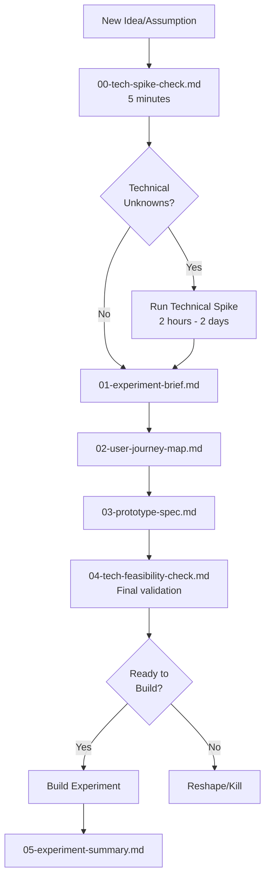

# Design Phase Template Flow - Revised

## The New Flow (With Early Technical Assessment)

## Key Improvements

### 1. Early Technical De-risking

- **00-tech-spike-check.md** happens FIRST (5 min assessment)
- Identifies unknowns before any design work
- Prevents wasted effort on technically infeasible ideas

### 2. Progressive Disclosure

- Simple experiments bypass the spike
- Complex experiments get investigated early
- Production complexity estimated upfront

### 3. Two-Gate System

- **Gate 1:** Initial spike check (can we even do this?)
- **Gate 2:** Final feasibility (can we do this quickly?)

## When to Use Each Template

| Template | When | Time | Purpose |
|----------|------|------|---------|
| 00-tech-spike-check | Immediately when idea proposed | 5 min | Identify technical unknowns |
| Technical Spike | If unknowns exist | 2hr-2days | Validate technical approach |
| 01-experiment-brief | After technical path clear | 30 min | Define hypothesis & metrics |
| 02-user-journey-map | After brief approved | 20 min | Map critical path |
| 03-prototype-spec | After journey defined | 30 min | Specify minimal UI |
| 04-tech-feasibility-check | After prototype designed | 15 min | Final build assessment |
| 05-experiment-summary | After experiment ends | 30 min | Capture learnings |

## The Old Problem vs New Solution

### Old Problem

- Technical issues discovered AFTER design work
- Wasted effort on infeasible experiments
- "Surprise" complexity during build
- No early warning system

### New Solution

- Technical gut check in first 5 minutes
- Spike investigations before commitment
- Progressive complexity awareness
- Clear go/no-go gates

## Success Metrics for New Flow

- **Reduction in killed experiments** after design phase (target: <10%)
- **Increase in technical spikes** that prevent bad experiments (target: 20% of ideas)
- **Decrease in "surprise complexity"** during build (target: <5%)
- **Faster time-to-decision** on technical feasibility (target: same day)

## Cultural Shift Required

Teams must embrace:

- "Fail fast on technical barriers"
- "Spike before you design"
- "5 minutes upfront saves 5 days later"
- "Not all ideas deserve experiments"

## Red Flags That You're Doing It Wrong

- ❌ Skipping the spike check because "we think it's simple"
- ❌ Running spikes that take more than 2 days
- ❌ Designing beautiful prototypes for technically impossible ideas
- ❌ Ignoring spike results because we're attached to the idea
- ❌ Not documenting spike learnings for future reference
