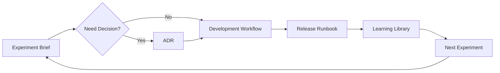

# Technical Documentation: Our Learning Machine

> **We are not a company. We are a learning machine.**
> 
> These documents exist to accelerate learning, not document completion.

## Our Philosophy

This documentation system embodies the **Learning Machine Manifesto**:

- **Assume Nothing, Test Everything** - Every document starts with hypotheses, not facts
- **Seek Velocity, Not Perfection** - Templates prioritize speed of learning over comprehensive coverage  
- **Celebrate Funerals for Bad Ideas** - We track and celebrate invalidated assumptions
- **Data Over Drama** - Clear separation of observations from interpretations
- **Guardrails, Not Handcuffs** - Process that makes the safe path the easy path
- **The Loop is Our Lifeline** - Every document feeds the Build-Measure-Learn cycle
- **Mindset is the OS** - Culture over process, principles over procedures

## Core Workflow



> **🤖 Automation Note:** View real-time status of this workflow on our [Mission Control Dashboard](dashboard/index.html) (generated by [`dashboard-generator`](support-tools/dashboard-generator/))

## Quick Navigation

### 🧪 **Currently Experimenting?**
Start with [Experiment Brief Template](experiments/experiment-brief.md)

### 🏗️ **Building Something?** 
Check [Tech Stack](systems/tech-stack.md) and [Architecture Guide](systems/architecture-guide.md)

### 🚀 **Ready to Ship?**
Use [Release Runbook](runbooks/release-runbook.md)

### 🎓 **Want to Learn?**
Browse [Learning Library](learning/learning-library.md) for invalidated assumptions

### ⚡ **Making a Big Decision?**
Create an [ADR](decisions/adr-template.md)

## The 3 AM Test

*Can you answer these instantly?*

1. **What's your riskiest assumption right now?** → Check current [experiments/](experiments/)
2. **How are you testing it this week?** → See active experiment briefs
3. **What result would kill this hypothesis?** → Review kill criteria in experiments
4. **What did you learn from your last failure?** → Browse [learning-library.md](learning/learning-library.md)
5. **What assumption did you invalidate this month?** → Check recent funeral celebrations

## Document Lifecycle

```
Hypothesis → Experiment → Learning → Evolution
     ↑                                    ↓
     ←─────── Next Hypothesis ←──────────
```

Every document should:
- Start with a hypothesis or assumption
- Define success/failure criteria  
- Generate measurable outcomes
- Spawn new questions

## Evolution Rules

This system is a **living experiment**:

- **Templates evolve based on usage data**
- **Dead documents get archived monthly**
- **New templates emerge from team needs**  
- **Complexity gets ruthlessly pruned**

---

*Last Updated: [Date] | Next Review: After next major learning*